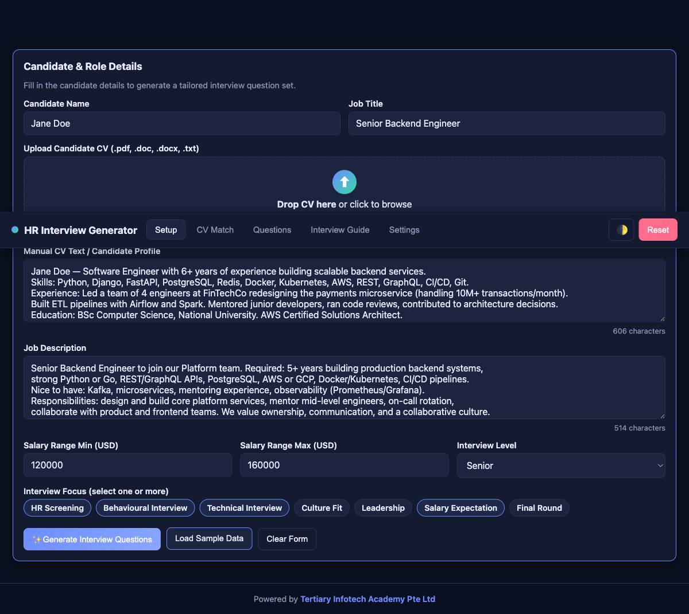

<div align="center">

# HR Interview Question Generator

[](https://developer.mozilla.org/en-US/docs/Web/HTML)
[](https://developer.mozilla.org/en-US/docs/Web/CSS)
[](https://developer.mozilla.org/en-US/docs/Web/JavaScript)
[](#)
[](#license)

**A single-file, zero-build interactive HR tool to generate structured, candidate-tailored interview questions from a CV, job description, and salary range.**

[Live Demo](https://alfredang.github.io/hr-interviewing/) · [Report Bug](https://github.com/alfredang/hr-interviewing/issues) · [Request Feature](https://github.com/alfredang/hr-interviewing/issues)

</div>

## Screenshot



## About

The **HR Interview Question Generator** helps HR personnel design rigorous, role-specific interview plans in seconds. Paste a candidate's CV and a job description, set the salary range and interview level, and the tool produces a fully structured interview pack: a CV ↔ JD match analysis, 15+ tailored questions across eight competency areas, and a printable HR interview guide with scripts and a recommendation checklist.

The entire app is **one self-contained `index.html` file** — no build step, no framework, no backend. It runs anywhere a browser does.

### Key Features

| Feature | Description |
|---|---|
| 📋 Setup form | Candidate name, drag-and-drop CV upload (auto-extracts `.txt`), JD textarea, salary range, level, focus areas |
| 🎯 CV ↔ JD analysis | Match score (0–100), matching/missing skills, salary alignment, seniority fit, concerns |
| ❓ Question generation | 15+ questions across 8 categories (Background, Role Fit, Skills, Behavioural, Culture, Salary, Red Flags, Closing) |
| 🔍 Question controls | Live search, category filter, shortlist ★, hide, copy, per-question HR notes |
| 📄 Interview guide | Auto-built guide with opening/salary/closing scripts, core questions, recommendation checklist — copy / download `.txt` / print |
| 📊 Dashboard | Match score, missing skills, shortlisted count, readiness pill (Strong Fit / Ready / Needs Tech Review / Salary Review / Mismatch) |
| 🌗 Theme | Dark default + light mode, persisted to `localStorage` |
| 🔐 Token panel | Local-only Claude token storage with show/hide, ready for future API integration |
| 📱 Responsive | Mobile-friendly grid layout with sticky tab nav |

## Tech Stack

| Category | Technology |
|---|---|
| Markup | HTML5 |
| Styling | CSS3 (CSS variables for theming, Grid, conic-gradient gauge, `@media print`) |
| Logic | Vanilla JavaScript (ES2020, single IIFE, no frameworks) |
| Storage | `localStorage` (token + theme) |
| Files | `FileReader` API, drag-and-drop, `Blob` downloads, `navigator.clipboard` |
| Hosting | GitHub Pages (static) |

## Architecture

```
┌────────────────────────────────────────────────────────────┐
│                    index.html (single file)                │
├────────────────────────────────────────────────────────────┤
│  ┌──────────────┐   ┌──────────────┐   ┌──────────────┐    │
│  │  Setup Tab   │   │ Analysis Tab │   │ Questions Tab│    │
│  │ form + CV    │──▶│ score gauge  │──▶│ cards + ctrl │    │
│  └──────┬───────┘   └──────────────┘   └──────┬───────┘    │
│         │                                      │            │
│         ▼                                      ▼            │
│  ┌──────────────────────────────┐    ┌──────────────────┐  │
│  │   Matching Engine (JS)       │    │ Interview Guide  │  │
│  │  • extractSkills()           │    │ • scripts        │  │
│  │  • computeMatch()            │    │ • core Qs        │  │
│  │  • analyzeSalaryAlignment()  │    │ • copy/dl/print  │  │
│  │  • analyzeSeniorityFit()     │    └──────────────────┘  │
│  └──────────────────────────────┘                          │
│         │                                                   │
│         ▼                                                   │
│  ┌──────────────────────────────┐                          │
│  │   Question Templates (JS)    │                          │
│  │  8 categories × N templates  │                          │
│  └──────────────────────────────┘                          │
│                                                             │
│  callClaudeAPI(prompt, token)  ◀── future Claude API hook  │
└────────────────────────────────────────────────────────────┘
            │
            ▼
   ┌─────────────────┐
   │  localStorage   │  hriq.token, hriq.theme
   └─────────────────┘
```

## Project Structure

```
hr-interviewing/
├── index.html        # The entire app (HTML + CSS + JS)
├── screenshot.png    # README screenshot
└── README.md
```

## Getting Started

### Prerequisites

A modern browser. That's it.

### Run Locally

```bash
git clone https://github.com/alfredang/hr-interviewing.git
cd hr-interviewing
open index.html        # macOS
# or simply double-click index.html
```

For a local server (recommended for clipboard / file APIs):

```bash
python3 -m http.server 8000
# then open http://localhost:8000
```

### Try It

1. Click **Load Sample Data** to populate the form with a Senior Backend Engineer example
2. Click **✨ Generate Interview Questions**
3. Explore the **CV Match**, **Questions**, and **Interview Guide** tabs

## Deployment

This repo deploys automatically to **GitHub Pages** via a GitHub Actions workflow on every push to `main`.

To deploy your own fork:
1. Fork the repo
2. Settings → Pages → Source: **GitHub Actions**
3. Push to `main` — your site will be live at `https://<your-user>.github.io/hr-interviewing/`

You can also drop `index.html` into any static host (Netlify, Vercel, Cloudflare Pages, S3, an `<iframe>`, a USB stick).

## Future Claude API Integration

The prototype simulates question generation locally. To wire in the real Claude API, implement the `callClaudeAPI(prompt, token)` placeholder in `index.html` and route generation through it when a saved token is present.

```javascript
async function callClaudeAPI(prompt, token) {
  // POST to Anthropic API with the user's saved token
}
```

## Contributing

1. Fork the repo
2. Create a feature branch (`git checkout -b feat/my-improvement`)
3. Commit your changes
4. Open a Pull Request

Issues and feature requests welcome via [GitHub Issues](https://github.com/alfredang/hr-interviewing/issues).

## License

MIT — free to use, modify, and distribute.

## Developed By

**Tertiary Infotech Academy Pte. Ltd.** — [tertiarycourses.com.sg](https://www.tertiarycourses.com.sg)

## Acknowledgements

- Built with vanilla web standards — no frameworks were harmed in the making of this app
- Question structure inspired by competency-based and STAR interviewing best practices

---

<div align="center">

⭐ If this tool helps your hiring process, please consider starring the repo!

</div>
